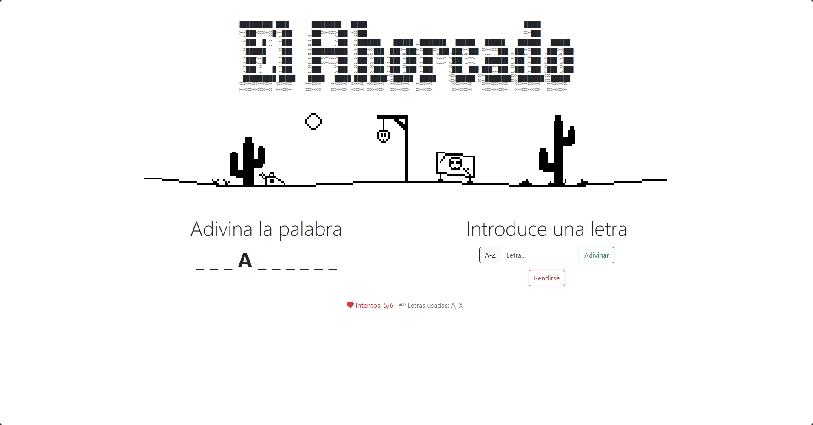
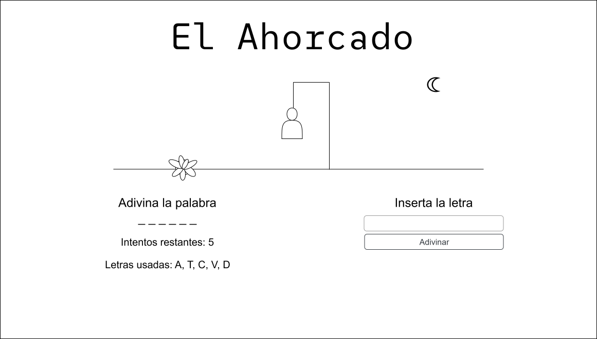
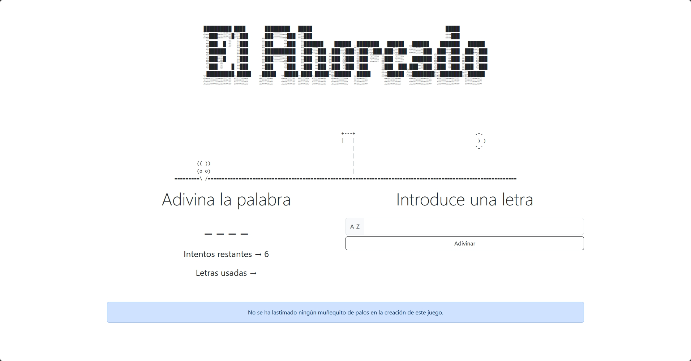

<div align=justify>

# El Ahorcado

<div align=center>
  
</div>

<hr

Este es un proyecto simple en **PHP** que implementa el clásico juego del **ahorcado** en el navegador usando sesiones.

# Tabla de contenidos

- [El Ahorcado](#el-ahorcado)
- [Tabla de contenidos](#tabla-de-contenidos)
  - [Requisitos](#requisitos)
  - [Puesta en marcha](#puesta-en-marcha)
  - [Estructura de archivos](#estructura-de-archivos)
  - [Mockup](#mockup)
  - [Imagenes de versiones pasadas](#imagenes-de-versiones-pasadas)
    - [Versión 1](#versión-1)


## Requisitos

- Tener docker y contenedor de docker de **PHP >= 7.4**.
- Un navegador web.
- Paquete `just` para lanzar comandos con facilidad (opcional).

## Puesta en marcha

1. Si tiene instalado el paquete `just` en su sistema, basta con lanzar `just` o `just start` en la raiz del proyecto para levantarlo.
2. Si no, levante el proyecto con `docker compose up -d --build`.
3. Una vez levantado, acceda al proyecto a través de [localhost:8080](http://localhost:8080/).
4. Para cerrar el proyecto, ejecute `just stop` (si tiene instalado `just`) o `docker compose down`.

## Estructura de archivos

```
ahorcado/
├── config
│   └── config.php
├── data
│   ├── games.json
│   └── words.json
├── public
│   ├── icon.svg
│   ├── img
│   │   ├── banner0.gif
│   │   ├── banner1.gif
│   │   ├── banner2.gif
│   │   ├── banner3.gif
│   │   ├── banner4.gif
│   │   ├── banner5.gif
│   │   └── banner6.gif
│   └── index.php
└── src
    ├── Application
    │   └── Services
    │       └── GameService.php
    ├── Domain
    │   ├── Entity
    │   │   └── Game.php
    │   └── Repository
    │       ├── GameRepositoryInterface.php
    │       ├── SessionRepositoryInterface.php
    │       └── WordRepositoryInterface.php
    ├── Infrastructure
    │   ├── Autoload
    │   │   └── Autoloader.php
    │   └── Persistence
    │       ├── JsonGameRepository.php
    │       ├── JsonWordRepository.php
    │       └── SessionRepository.php
    └── Presentation
        ├── Controllers
        │   ├── GameController.php
        │   └── Renderer.php
        └── Views
            ├── InGame
            │   ├── gameMenu.html
            │   ├── leftSection.php
            │   ├── rightSection.php
            │   └── stats.php
            ├── newGameForm.html
            └── title.html
```

## Mockup

<div align=center>
  
</div>

## Imagenes de versiones pasadas

### Versión 1

<div align=center>
  
</div>

</div>